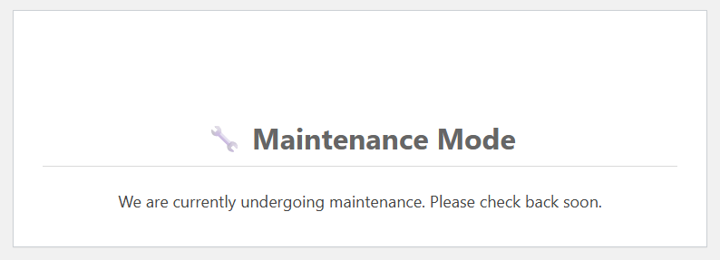
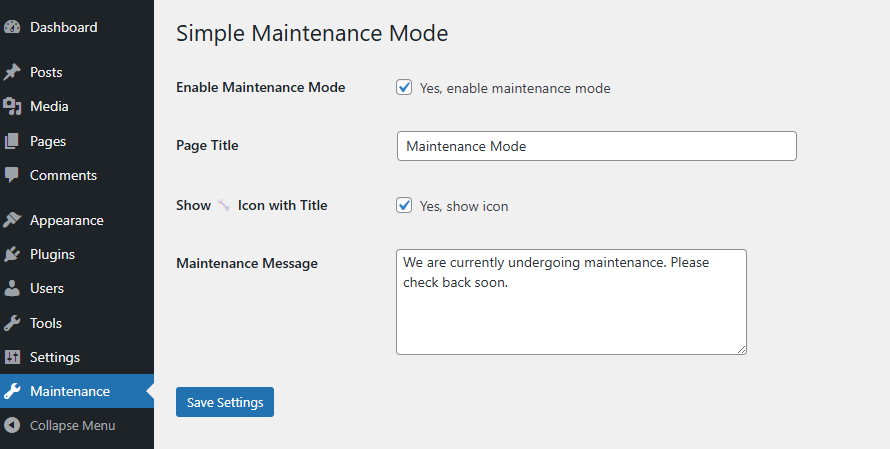

# Simple Maintenance Mode by Quiet Bolt

A clean, lightweight WordPress plugin to enable a simple Maintenance Mode screen for visitors — fully customizable with title, message, and optional icon.

## 🔧 Features

- ✅ Enable or disable maintenance mode easily from the admin panel
- 📝 Editable page title and message
- 🔧 Optional maintenance icon with the title
- 🎯 503 HTTP response for search engine compliance
- 👤 Logged-in administrators bypass maintenance screen
- 💡 Simple, centered UI — no theme changes required

---

## 📦 Installation

1. Upload the folder `simple-maintenance-mode` to `/wp-content/plugins/`.
2. Activate the plugin via **Plugins > Installed Plugins**.
3. Navigate to **Maintenance** in the WordPress dashboard sidebar.
4. Customize the maintenance message and enable the mode.

---

## ❓ FAQ

### Can I change the icon?
Not yet — you can toggle the default 🔧 icon on or off. Full icon picker is planned in a future version.

### Will search engines index the maintenance page?
No — the plugin sends a `503 Service Unavailable` header, letting search engines know the downtime is temporary.

### Who will see the maintenance screen?
Anyone who is not logged in as an administrator. Logged-in admins will see the site normally.

---

## 🗒️ Changelog

### 1.0
- Initial stable release
- Title, message, and icon display options
- 503 response handling
- Admin-only bypass

---

## 🧑‍💻 Contributors

- [Quiet Bolt](https://github.com/quietbolt)

---

## 📄 License

This plugin is licensed under the GPLv2 or later.  
See [LICENSE](https://www.gnu.org/licenses/gpl-2.0.html) for more details.

---

> Made with ❤️ by [Quiet Bolt](https://github.com/quietbolt)